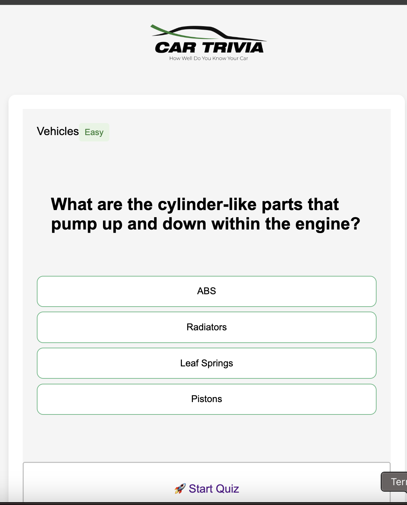

### 🚗 Car Quiz Game 
An interactive, car-themed trivia game built with HTML, CSS, and Vanilla JavaScript, using the Open Trivia DB API. This quiz tests your car knowledge through multiple-choice questions and gives you a score at the end!

### 🧠 Overview
This project is part of the Moringa Phase 1 assessment. The objective is to build a fully functional Single Page Application (SPA) that:

Interacts with a public API

Integrates core frontend technologies (HTML/CSS/JS)

Demonstrates state management, DOM manipulation, and event handling

🔧 Setup & Deployment
1. Repository Setup
Private repo in Moringa-SDF-PT10 organization

Repo name format: ellis-lunayo-trivia-project

```
2. Project Structure
pgsql
Copy
Edit
car-quiz/
├── assets/              # Images, icons, etc.
│   └── logo.png
├── index.html
├── styles.css
├── index.js
├── README.md
└── 
3. Run Locally
Clone the repository:

bash
Copy
Edit
git clone https://github.com/Moringa-SDF-PT10/ellis-lunayo-trivia-project.git
Open index.html in your browser.
```

4. GitHub Pages Deployment
Make sure to push a gh-pages branch:

bash
Copy
Edit
git checkout -b gh-pages
git push origin gh-pages
App will be available at:

bash
Copy
Edit
https://github.com/Moringa-SDF-PT10/ellis-lunayo-trivia-project.git

### 🕹️ How to Play
Click Start Quiz to begin.

Answer the questions by selecting one of the multiple-choice options.

After each selection, you’ll get instant feedback (Correct / Incorrect).

At the end, view your total score and correct answers for questions you missed.

Click Restart Quiz to try again with a new set of questions.

✅ Core Features
✅ Start screen with a Start Quiz button

✅ Dynamic fetch of multiple-choice questions from Open Trivia DB

✅ Clickable answers with immediate feedback

✅ Scoreboard after completing the quiz

✅ Option to Restart Quiz

✨ Bonus Features
These features are not required but add extra polish:

🔄 Custom quiz setup (select question count, difficulty, category)

👉 "Next Question" button instead of all-at-once layout

📸 Screenshots



🛠️ Tech Stack

HTML5

CSS3

JavaScript (ES6+)

Open Trivia DB API

💡 Lessons Learned
Fetching and rendering API data dynamically

DOM manipulation using vanilla JavaScript

Managing game state across multiple questions

Creating responsive layouts with pure CSS

📝 Project Status
✅ Fully functional basic quiz
🚧 Bonus features in progress (or mention what you’ve completed)

📬 Contact
Created by Ellis lunayo
📧 Email: your ellislunayo@gmail.com
💼 GitHub: @shikokoti